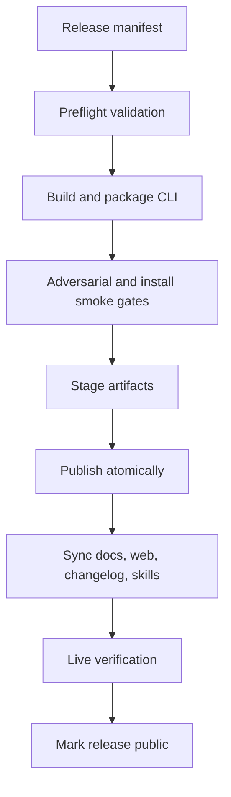

# BRIK64 Release Train CI/CD Plan

Status: implemented and being hardened for beta10/beta11 release execution.

Date: 2026-06-07

## Goal

BRIK64 releases must move as one coordinated train. A public version is not
released until every required public surface has either been updated and
verified or explicitly marked out of scope in the signed release manifest.

The train covers:

- CLI curl installer and downloadable artifacts.
- GitHub tag, release notes, and release assets.
- SDK packages for the active public marketplaces.
- Web install surfaces and changelog.
- Documentation pages.
- Public agent skill surfaces.
- Post-release live verification.

## Current State

- beta10 source alignment is active across CLI, SDK, docs, web and skills.
- Dry-run, sync-payload generation, publication-plan generation, and live
  verification scripts exist and are wired to GitHub Actions.
- The publish workflow is fail-closed and mutation-capable when invoked with the
  exact manifest digest, confirmation string, and `execute_publication=true`.
- beta10 publication must be closed only by the publish workflow plus live
  verification. A green PR, GitHub Release, or one marketplace alone is not a
  release.
- `repository_dispatch` consumers exist for docs, web, and public skills.
- Operational runbook: `docs/RELEASE_TRAIN_RUNBOOK.md`.
- Active closure checklist:
  `docs/BETA10_AND_BETA11_ROADMAP_CHECKLIST.md`.

## Release Train Checklist

- [x] Document required release surfaces and failure policy.
- [x] Define release manifest as the single source of truth.
- [x] Define conservative worktree consolidation rules.
- [x] Add manifest validation command.
- [x] Add dry-run orchestration workflow.
- [x] Add publication workflow gated by dry-run evidence.
- [x] Add sync-payload generation for docs, web, changelog, and skills.
- [x] Add publication-plan preflight with explicit secret and confirmation gates.
- [x] Add live verification workflow.
- [x] Add rollback and supersede guidance to the publication plan report.
- [x] Merge the workflow branch into the active release branch.
- [x] Configure required publication secrets in GitHub environments.
- [x] Add mutation-capable channel executors for GitHub Release, GCP curl
  surface, SDK marketplaces, docs, web, and skills.
- [x] Add manifest consumers for docs, web, and public skills.
- [x] Run the full train for beta5 from the active branch.
- [x] Deploy web after beta5 source alignment.
- [x] Run post-deploy live verification for beta5.

## Architecture

The manifest is the only input allowed to name the public version. Workflows
must fail if a version appears in package files, docs, changelog, skills, or
installer metadata but does not match the manifest.

## Required Workflows

### 1. `release-manifest-validate`

Runs on pull requests and manual dispatch.

Checks:

- manifest schema is valid JSON.
- public version is semver prerelease or semver stable.
- CLI artifacts, SDK packages, docs, web, and skills surfaces are declared.
- no public changelog entry contains internal decision language.
- no known secret patterns are present.
- all required source repos and target refs are named.

Output:

- machine-readable validation report.
- release train readiness status.

### 2. `release-train-dry-run`

Runs on manual dispatch from the release branch.

Checks:

- builds CLI candidate.
- packages SDK candidates without publishing.
- regenerates public docs and web changelog inputs.
- validates public skill metadata against version-independent rules.
- runs smoke tests against local or staged artifacts.
- produces an immutable dry-run evidence bundle.

No public endpoint is modified by this workflow.

Implementation requirements discovered during beta8:

- checkout must use `fetch-depth: 0` so source-commit ancestry checks are real;
- the workflow must provide `GH_TOKEN` so the GitHub verified-signature gate can
  query commit verification;
- the dry-run command must start from a clean worktree;
- standalone report writers must not run immediately before dry-run in the same
  job because they intentionally modify evidence reports.

### 3. `release-train-publish`

Runs only after a successful dry run for the same manifest digest.

Current implementation:

- validates manifest, dry-run, live public surfaces, and sync payloads;
- requires an operator-supplied manifest digest;
- requires exact confirmation text before publication preflight can pass;
- checks required secret names without exposing values;
- writes a publication plan and rollback guidance;
- prepares SDK workspaces;
- publishes or confirms GitHub Release;
- publishes or confirms npm, PyPI, and crates.io SDK packages;
- uploads the curl/GCP installer and channel manifest;
- dispatches docs, web, and skills consumers;
- runs post-publish live verification.

The workflow must publish in a controlled order:

1. GitHub tag and release assets.
2. Marketplace SDK packages.
3. GCP curl artifacts and installer metadata.
4. Docs and web content sync.
5. Public skills sync.
6. Live verification.

Implementation requirements discovered during beta8:

- the publish workflow must also use `fetch-depth: 0`;
- pre-publication validation should call `npm run release:train:dry-run`
  directly from a clean checkout, not run report writers first;
- `release/manifest.json.state` must be `public` before mutation-capable
  publish preflight can pass;
- the manifest digest used in workflow inputs must be recomputed from `main`
  after every merge that changes manifest, workflow, README, or release
  evidence.

If any step fails before public traffic changes, the workflow aborts. If a step
fails after public traffic changes, the workflow must create a failed-release
record and require either rollback or supersede before another release can be
marked public.

### 4. `release-train-live-verify`

Runs after publish and on schedule for the active beta channel.

Checks:

- `https://brik64.com/cli/install.sh` installs the manifest version.
- `https://brik64.com/cli/beta.json` points to the same version and assets.
- docs install page shows the same version.
- web changelog shows only public functional changes.
- SDK marketplaces expose the same beta tag or documented equivalent.
- skills contain no private development nomenclature and are version-aware.

### 5. `repository_dispatch` consumers

Docs, web, and skills must consume `brik64-release-manifest` and either update
or verify their public surfaces.

Current consumers:

- `brik64-admin/brik64-docs-site`: `Update CLI release docs`.
- `brik64-admin/brik64.com`: `Consume BRIK64 release manifest`.
- `brik64/brik64-tools-skills`: `Consume BRIK64 release manifest`.

Dispatch success is not enough. Each consumer run must complete successfully,
and the final release verifier must pass against public URLs.

## Atomicity Rule

The release is not public when the first channel updates. The release is public
only when every required channel passes live verification for the same manifest
digest.

Allowed states:

- `draft`: manifest is being edited.
- `dry_run_passed`: local/staged evidence exists.
- `publishing`: public publication is in progress.
- `public`: all live surfaces verified.
- `failed`: at least one required surface failed after publish began.
- `superseded`: replaced by a newer manifest.

Any other state is invalid.

State transitions are gates, not labels:

- `draft`: acceptable for PR candidate work and dry-run evidence.
- `public`: required for mutation-capable publication.
- `failed` or `superseded`: required if any public channel mutates and the
  train cannot close.

Do not set `public` to make a check pass unless all required release surfaces
are ready to publish and the public wording has been updated from candidate to
public language.

## Protected Branch Rule

The `main` branch protection is part of the release system. Future release PRs
must be shaped so the author/pusher and approver are different code owners.

Required pattern:

- PR opened/pushed by one maintainer account.
- Code owner approval by the other maintainer account.
- all review threads resolved or made outdated by a real fix;
- no admin override used as release evidence;
- squash merge is acceptable when GitHub signs the merge commit and branch
  protection reports `CLEAN`.

If GitHub reports `REVIEW_REQUIRED` despite a visible approval, inspect branch
protection and the protected-branch rejection message. The usual cause is
`require_last_push_approval` or an unresolved review thread.

## Changelog Policy

Public changelogs describe user-visible changes only:

- new commands or changed command behavior.
- installer and platform support changes.
- SDK API changes.
- fixed user-visible bugs.
- security, compatibility, or migration notes.

Public changelogs must not describe internal methodology, approval decisions,
publishing route choices, private engine tiers, or operational debates.

## Skills Policy

Public skills must be version-independent at install time. A skill may discover
the active CLI version through a public manifest or `brik64 --version`, but it
must not hard-code private release methodology or internal generation labels.

Skills should guide the user through:

- installing or verifying the CLI.
- choosing normal SDK development, mixed SDK and PCD work, or full BRIK64 flows.
- checking that local tools match the public manifest.

## Secrets Policy

Workflow secrets must be named by purpose, not by secret value. The release
manifest may reference required secret names but must never contain tokens.

Required classes:

- GitHub release and repository write token.
- GCP object storage or deployment credential.
- npm publication token.
- PyPI publication token, if Python SDK is active.
- crates.io publication token, if Rust SDK is active.
- docs deployment credential.
- web deployment credential.
- skills repository write credential.

Every publishing job must fail closed when its required secret is unavailable.

## Acceptance Criteria

The CI/CD train is acceptable when:

- a pull request cannot merge with manifest drift.
- a release cannot publish with mismatched docs, web, SDK, skills, or installer
  versions.
- a failed channel blocks the final `public` state.
- the live verifier can independently prove the public version from public URLs
  and marketplace APIs.
- rollback or supersede instructions exist for every public channel.

## Beta5 Closure Evidence

- `brik64/brik64-cli` release train live verifier:
  - run: `27021364994`;
  - version: `0.1.0-beta.5`;
  - manifest digest:
    `058440c5d913a3b2cda8dc23d5ac063cb5de164c35d798aa74d289afac68bc95`;
  - decision: `PASS_RELEASE_TRAIN_LIVE_VERIFY`;
  - failures: `[]`.
- Web consumer: `brik64-admin/brik64.com` run `27021224604`, success.
- Skills consumer: `brik64/brik64-tools-skills` run `27021224890`, success.
- Docs consumer: `brik64-admin/brik64-docs-site` run `27021224066`, success.
- Web deployment: Cloudflare Pages deployment
  `https://9108ce89.brik64-web-brik64com.pages.dev`.
- Additional live routes verified after deploy:
  - `https://brik64.com/sdks`;
  - `https://brik64.com/download`;
  - `https://brik64.com/presskit`;
  - `https://brik64.com/home-cli/agent.json`.
